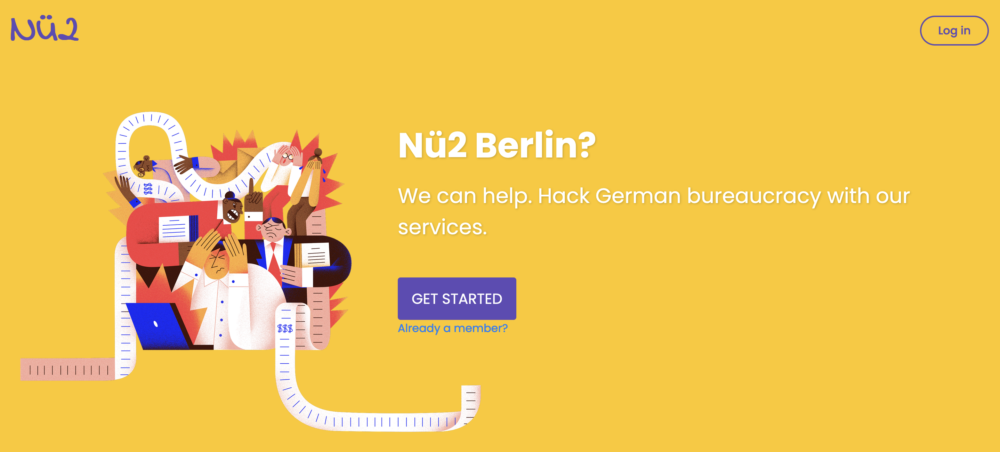

# Nü2
<h3 align="center">
  
</h3>
  
Nü2 is an application that allows users to navigate through the Berlin bureaucracy. It allows a user to create appointments with the Bürgeramt (Citizens office), find a bank and health insurance provider based on a selection of WAY (Who are you) questions during the registration process.

Nü2 was a project produced during Le Wagon bootcamp programme. It has no integration with the Bürgeramt and booking can not be made.

## Versions
The following should be within the GEM file
```ruby
  # Ruby Version
  ruby '2.7.3'
  # Rails version
  'rails', '~> 6.1.4'
```

## System dependencies
```bash
  # Bundler
  brew install bundler
  # Node / npm
  brew install node
  # Yarn
  brew install yarn
```
## Installation
The following process is requried for installation.

```bash
  # Bundle
  bundle install

  # Yarn
  yarn install

  # Database and Migrations
  rails db:create

  rails db:migrate

  rails db:seed
```

## Run server
```bash
  rails s
```

## Features
The following features and APIs were used within Nü2, an API key is required.
* [Mapbox](https://www.mapbox.com/)
